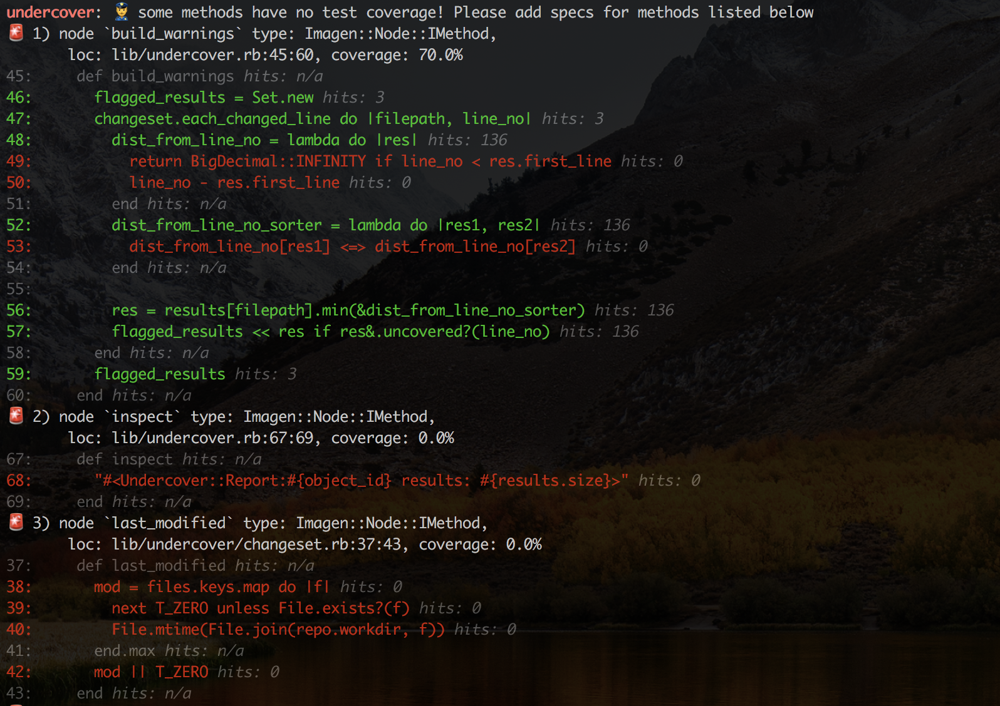

`undercover` warns about methods, classes and blocks that **were changed without tests**, to help you easily find untested code and reduce the number of bugs. It does so by analysing data from git diffs, code structure and SimpleCov coverage reports.

Works with any Ruby CI pipeline as well as locally as a CLI.

- Visit **[https://undercover-ci.com](https://undercover-ci.com)** to set up code review checks with the GitHub App, or use one of the [CI integrations](#code-review-integrations)
- Learn how to find untested code changes locally with the [CLI](#usage)


[](https://github.com/grodowski/undercover/actions)


A sample output of `undercover` ran before a commit may look like this:



And like this, given that specs were added:


## Installation

Add this line to your application's Gemfile:

```ruby
gem 'undercover'
```

And then execute:

    $ bundle

Or install it yourself as:

    $ gem install undercover

## Setting up coverage reporting

To make your specs or tests compatible with `undercover`, please add `undercover` to your gemfile to use the undercover formatter the test helper.

```ruby
# Gemfile
group :test do
  gem 'undercover'
end

# the very top of spec_helper.rb
require 'simplecov'
require 'undercover/simplecov_formatter'

# optional, the filename defaults to `coverage.json` and is automatically recognised by the gem
# SimpleCov::Formatter::Undercover.output_filename = 'my_project_coverage.json'
SimpleCov.formatter = SimpleCov::Formatter::Undercover

SimpleCov.start do
  add_filter(/^\/spec\//) # For RSpec
  add_filter(/^\/test\//) # For Minitest
  enable_coverage(:branch) # Report branch coverage to trigger branch-level undercover warnings
end
# ...
```

Then run your test suite once through to generate the initial coverage file before you can run the `undercover` command.

## Upgrading from pre-0.7.0

If you're upgrading from an older version of undercover that used LCOV, you can migrate to the new SimpleCov formatter:

1. Add `gem 'undercover'` to your test group
2. Replace the LCOV formatter setup with the new SimpleCov formatter

```ruby
# Gemfile
group :test do
  gem 'undercover'
end

# spec_helper.rb
require 'simplecov'
require 'undercover/simplecov_formatter'
SimpleCov.formatter = SimpleCov::Formatter::Undercover
```

3. Update CLI usage: Use `--simplecov` flag instead of `--lcov`, or rely on auto-detection of `coverage/coverage.json`

Note: LCOV support will be deprecated in a future release, but remains fully functional for existing projects.

## Usage

Invoked with no arguments, Undercover will flag all untested methods and classes from the current diff:

```sh
undercover
```

Use the `-c --compare ref` flag to specify a git ref (commit hash, branch name, tag) to compare against. **This is a recommended usage for CI/CD build environments**, as `undercover` will `exit 1` if there are any warnings.

```sh
undercover --compare origin/master
```

Check out `docs/` for CI configuration examples:
- [GitHub Actions](docs/actions.yml)
- [CircleCI - simple](docs/circleci_config.yml)
- [CircleCI - advanced](docs/circleci_advanced.yml)
- [Semaphore](docs/semaphore.yml)

Merging coverage results ([sample gist](https://gist.github.com/grodowski/9744ff91034dce8df20c2a8210409fb0)) is required for parallel tests before processing with `undercover`.

## Code review integrations

A few options exist to provide automated comments from `undercover` in Pull Request reviews, which is the most streamlined way to add Undercover to your development workflow.

- [UndercoverCI](https://undercover-ci.com) - `undercover` Pull Request feedback delivered natively with GitHub Checks
- [pronto-undercover](https://github.com/grodowski/pronto-undercover)
- [danger-undercover](https://github.com/nimblehq/danger-undercover)
- [undercover-checkstyle](https://github.com/aki77/undercover-checkstyle)

## Configuration

### CLI Options

Options can be passed when running the command from the command line:

```sh
Usage: undercover [options]
    -s, --simplecov path             SimpleCov JSON report file
    -l, --lcov path                  LCOV report file path (to be deprecated)
    -p, --path path                  Project directory
    -g, --git-dir dir                Override `.git` with a custom directory
    -c, --compare ref                Generate coverage warnings for all changes after `ref`
    -r, --ruby-syntax ver            Ruby syntax version, one of: current, ruby18, ruby19, ruby20, ruby21, ruby22, ruby23, ruby24, ruby25, ruby26, ruby30, ruby31, ruby32, ruby33
    -w, --max-warnings limit         Maximum number of warnings to generate before stopping analysis. Useful as a performance improvement for large diffs.
    -f, --include-files globs        Include files matching specified glob patterns (comma separated). Defaults to '*.rb,*.rake,*.ru,Rakefile'
    -x, --exclude-files globs        Skip files matching specified glob patterns (comma separated). Empty by default.
    -h, --help                       Prints this help
        --version                    Show version
```

### Configuration File

A configuration file named `.undercover` can be created at the top level of a project's directory containing the same set of options for the CLI.
Example file:

```sh
-l path/to/different.lcov
-c origin/master
```

The options set in the file can be overriden by passing arguments when invoking the executable.

Options assume that the program is run from the top level of the project directory.

### Ignoring/skipping coverage

Projects with low or nonexistent test coverage are likely to generate large numbers of warnings. While the default workflow would be to address them before the PR approval, your strategy might be different.

In order to acknowledge an untested change and remove the UndercoverCI warning with the intention to improve later (or never), you can wrap the code block with the `:nocov:` syntax, e.g.

```rb
# :nocov:
def skip_this_method
    never_reached
end
# :nocov:
```

Read more about the `:nocov:` syntax in [SimpleCov's readme](https://github.com/simplecov-ruby/simplecov#ignoringskipping-code).

## Why?

I wanted to create a tool to help others and myself ensure that tests are written for all the recent code changes. This should be useful for any ruby project, but especially those large or legacy codebases that lack testing (and we can't or don't want to invest in full test coverage).

The goal was to provide automated warnings, that are:
- relevant, so scoped to the actual code changes
- timely, so we don't end up writing tests long after the implementation
- actionable, so we can fix them before the code is committed or reaches production

For more background, please [read the blog post](https://medium.com/futuredev/stop-shipping-untested-ruby-code-with-undercover-1edc963be4a6).

## Development

After checking out the repo, run `bundle` to install dependencies. Then, run `rake` to run the tests and RuboCop. You can also run `pry -r 'undercover'` for an interactive prompt that will allow you to experiment.

To install this gem onto your local machine, run `bundle exec rake install`. To release a new version, update the version number in `version.rb`, and then run `bundle exec rake release`, which will create a git tag for the version, push git commits and tags, and push the `.gem` file to [rubygems.org](https://rubygems.org).

## Contributing

Bug reports and pull requests are welcome on GitHub at https://github.com/grodowski/undercover.

## License

The gem is available as open source under the terms of the [MIT License](https://opensource.org/licenses/MIT).
